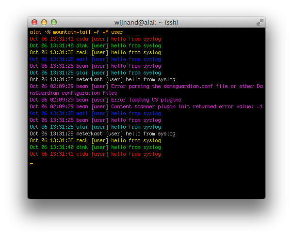
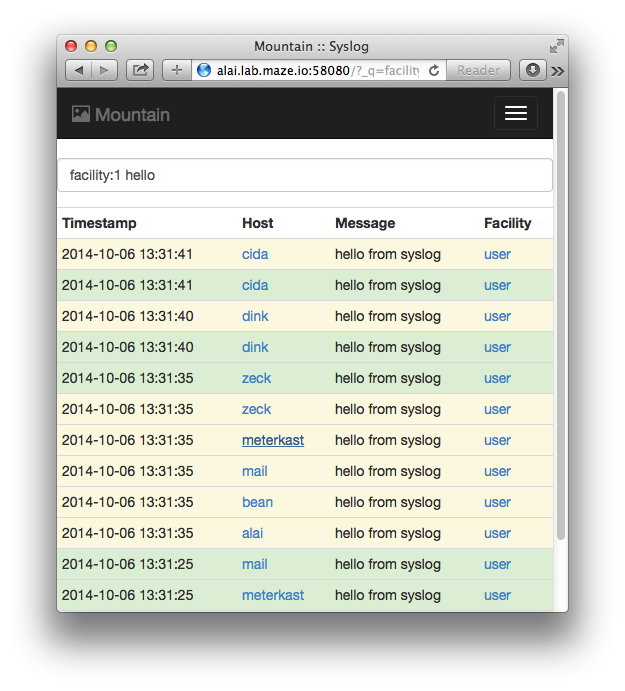

# mountain

Syslog dashboard for rsyslog, based on Flask and PostgreSQL.

# Tools

There are both command line interface and web based tools available.

## Command Line Interface `mountain-tail`

Works much like [tail](http://linux.die.net/man/1/tail) or
[multitail](http://linux.die.net/man/1/multitail):

    usage: mountain-tail [-h] [-f] [-n LINES] [-s SLEEP_INTERVAL]
                         [-F [FACILITY [FACILITY ...]]]
                         [-P [PRIORITY [PRIORITY ...]]]

    optional arguments:
      -h, --help            show this help message and exit
      -f, --follow
      -n LINES, --lines LINES
      -s SLEEP_INTERVAL, --sleep-interval SLEEP_INTERVAL
      -F [FACILITY [FACILITY ...]], --facility [FACILITY [FACILITY ...]]
                            syslog facilities (default: all facilities)
      -P [PRIORITY [PRIORITY ...]], --priority [PRIORITY [PRIORITY ...]]
                            syslog levels (default: everything up to notice)

Example:

## Web Interface `mountain-web`

